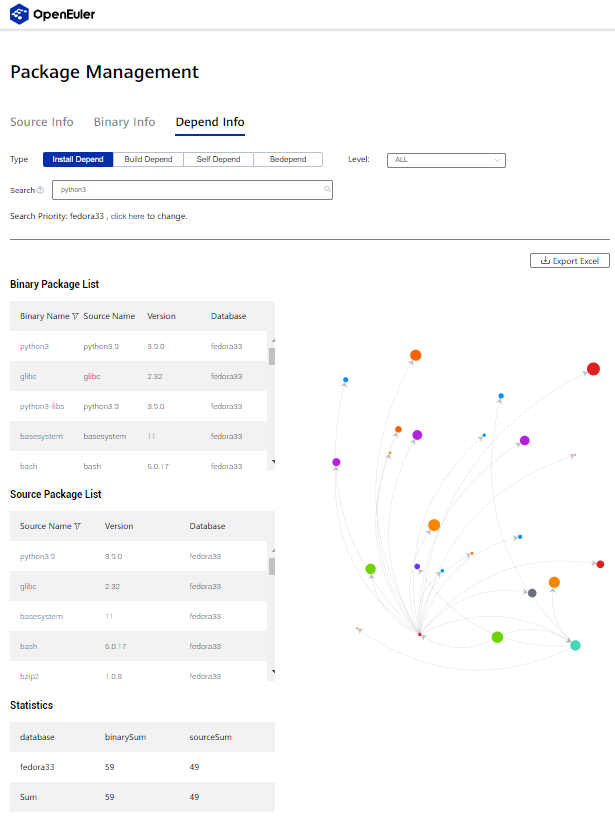
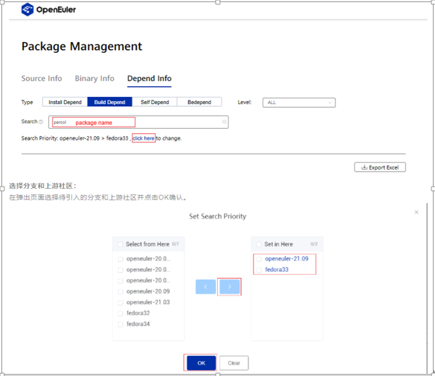
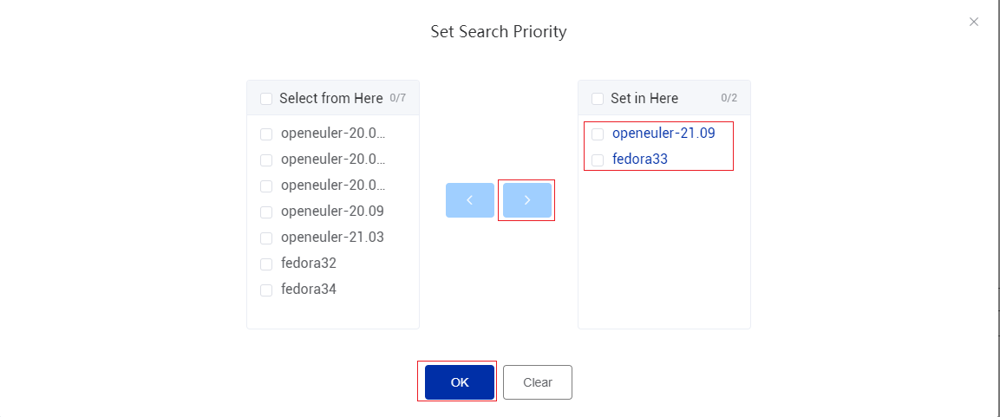
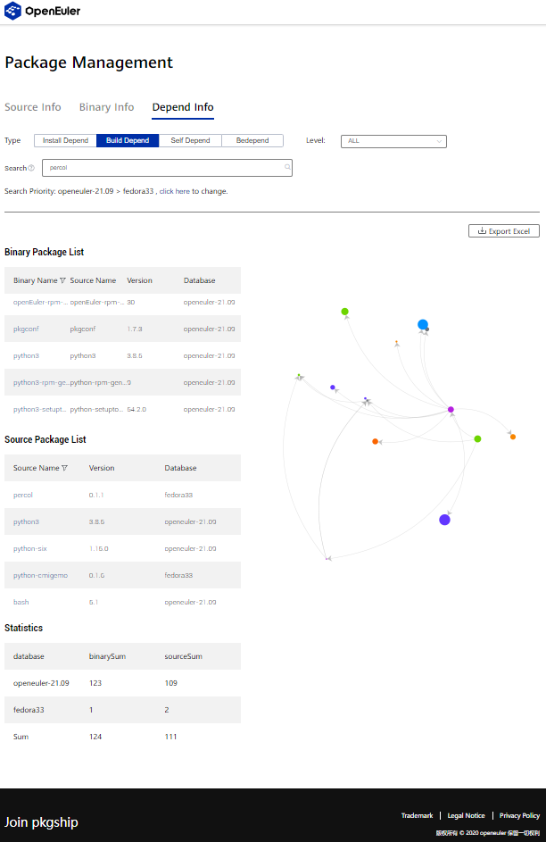
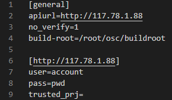

# Guide for Uploading a Software Package to the openEuler Community

This guide describes how to upload a software package to the openEuler community for contributors, so as to improve efficiency and ensure the package to be uploaded to meet certain requirements.

## 1. Checklist

Before submitting a pull request (PR), check whether the software package and related dependencies meet the admission rules of the openEuler community. The following table displays the checklist items.  


| Item                         | Description                                                  |
| ---------------------------- | ------------------------------------------------------------ |
| Normalization                | ● In most cases, a piece of software is uploaded to src-openeuler only once. |
| Source                       | ● Open-source software must be downloaded from its official website or the code hosting address specified by the official website. |
| Software Name                | ● The software name must be the same as that on the official website or in the community.  <br>● It is not allowed to use a sub-module in the software package as the software name.  <br>● If the software is the development library of a language, prefixes such as python- and perl-can be added for name standardization management. |
| Community Status             | You are not advised to upload the following software:                                                         <br>● software released by a well-known community or organization but no longer maintained;                                                                                                                                 <br> ● software released by individuals or a small-sized community/organization and has no new version uploads within two years;                                                                             <br>● software whose community operating status is unclear;                                                  <br>● software whose issues have not been addressed in the most recent six months. |
| Official Website (Mandatory) | ● Use the official website provided by the software vendor. If there is no official website, use the project website on mainstream code hosting platforms, such as GitHub.                                                                                                                                          <br>● Do not use websites of the following hosting platforms as the software official websites: Maven, MvnRepository, or SpringSource. |
| Software Package Information | ● Use the official download address of the source package for source tracing.                   <br>● If a binary package is required, the official download address of the binary package must be provided. |
| License                      | ● Check whether the software to be uploaded has a license.                                             <br>● Check whether the entered license is the same as that on the official website and in the software package.                                                                                                                 <br>● Exercise caution when uploading open source software with a high-risk license. |
| Copyright                    | ● Provide the copyright information contained in the official website, community, code hosting platform, source package, and release package. |


**Note:**

1.  Normalization: Before uploading multiple versions of a software package, such as MySQL and MySQL5, contact the technical committee and SIG.。
2. For details about the license check and copyright trustlist and blocklist, see the [SPDX License List](https://spdx.org/licenses/).


## 2. Analysis of Software Package Dependencies

You are advised to analyze the software package dependencies before submitting a PR to upload the software. The following provides several methods for dependency analysis.  

### 2.1. Using pkgship

pkgship is a package management tool developed by the openEuler team for software management in the openEuler community. It can be used to analyze dependencies of various openEuler versions and Fedora software packages, and query binary and source packages. You can download pkgship from [pkgship](https://pkgmanage.openeuler.org/).

#### 2.1.1. Online analysis

pkgship supports four types of dependency analysis: **Install Depend**, **Build Depend**, **Self Depend**, and **Bedepend**. Before uploading the software package, use pkgship to perform dependency online analysis to view excels of the installation dependency and compilation dependency.   

  


**Selecting an analysis type:**

On the **Package Management** page, click **Depend Info**, select a proper dependency analysis type, enter the package name, and click **click here** to select a repository.  

  

**Selecting a branch and an upstream community:**

On the page that is displayed, select the desired branch and upstream community and click **OK**.  

  


**Querying results:**

Click the magnifier icon, and pkgship automatically performs dependency analysis based on the user-defined settings.  

  


**Analyzing dependency query results:**

View the **Source Package List**. The source packages whose **Database** is displayed as **fedora33** are the packages to be uploaded.  

  


#### 2.1.2. Local Dependency Analysis

pkgship also supports local deployment and dependency analysis of user-defined sources. For details, visit https://gitee.com/src-openeuler/pkgship.  

**Note：**
If you find any problems when using pkgship, provide your feedback in the [pkgship repository](https://gitee.com/openeuler/pkgship/issues).


### 2.2. Analyzing Dependencies in the Upstream Community

For the software packages whose dependencies cannot be analyzed based on pkgship, you need to manually analyze their dependencies.

#### 2.2.1. Compilation Dependency

**Using the SPEC file provided by the upstream community**：

Query the compilation dependency of the package to be uploaded based on the dependency package name in the **BuildRequires** field in the SPEC file.

**Using the language management tool and dependency management file**：

If the upstream community does not provide the SPEC file, perform the analysis using the language management tool or specific dependency file. The following table lists the package manager and dependency management file types of some languages.  

| Language | Package Manager | File Type                 |
| -------- | --------------- | ------------------------- |
| C++      | CMake           | Makefile                  |
| java     | maven pom       | pom.xml                   |
| go       | go modules      | go.mod                    |
| rust     | cargo           | Cargo.toml                |
| ruby     | RubyGems        | *.gemspec                 |
| python   | pip             | requirements.txt/setup.py |
| Node.js  | npm/yarn        |                           |

**Tools to generate the SPEC file:**

-  For Python packages: [PyPorter](https://gitee.com/openeuler/pyporter)

-  For Ruby packages: [RubyPorter](https://gitee.com/openeuler/rubyporter)

-  For Node.js packages: [nodejsporter](https://gitee.com/openeuler/nodejsporter) 

-  For perlporter packages: [perlporter](https://gitee.com/openeuler/pyporter) 

  **Note:** After the tool is generated, check the following information:

  -  Check whether the description of the software is properly provided. (The description cannot be left blank, or contain only the package name.)
  - Check whether each part in SPEC is properly separated by empty lines to ensure the standardization and aesthetics. For example, empty lines should be added to the front of **%prep** and **%description**.


#### 2.2.2. Installing and Running Dependencies

**Using the SPEC file provided by the upstream community**：

Search for the installation dependency of the package to be uploaded based on the dependency package name in the **Requires** field in the SPEC file.

**Using the rpmbuild tool for analysis:**

```bash
rpm -a requires [package_name] # Check the installation dependency
```


## 3. Software Package Self-Verification

Perform dependency analysis and self-verification on the software package before submitting a PR.

### 3.1. SPEC Modification

#### 3.1.1.  Format Rectification and Static Check

- Modify the keyword sequence.
- Modify **changelog**. **changelog** in the SPEC file of the new software package only contains package **init**.
- Exclude sensitive words and retain non-sensitive patch comments. Generally, openEuler does not accept contents of the Fedora and RHEL upstream communities.
- Modify the **release** field. Set the **release** field of the new software package to **1**, and increase the value by 1 each time the SPEC file is modified.
- Compare the license list to ensure that no software packages with risky licenses are uploaded.

#### 3.1.2.  Code Source Tracking

- Ensure that the official website URL in the SPEC file is valid and can be accessed by the browser.

- Ensure that download address of the source package (**source0**) in the SPEC file is valid, and the source link package is consistent with the source package of the software. 

  - If the downloaded source package is different from the built-in source package, use the downloaded source package for verification.

    - ```bash
       md5sum package name 1 package name2   # Check whether the two character strings are the same.
       ```  
      

  -  If the download link of **source0** is unavailable, search for the download link that can be used by the version maintained by an upstream community (similar to GitHub) for re-verification. (You can find clues from the comments of the original SPEC file.).

### 3.2  rpmbuild

Use rpmbuild to verify local compilation.  

```bash
rpmbuild -ba [spec file] # Use the -ba parameter to build a binary package and a source package based on the SPEC file.
```


### 3.3. [OBS](https://117.78.1.88/) Compilation Verification

Although rpmbuild can be used for local compilation verification, the OBS compilation result may be different from the local compilation result because the OBS environment is different from the local environment. Therefore, before submitting a PR, find the corresponding branch from OBS and perform compilation verification.

#### 3.3.1. OSC Environment Configuration

Create the **.oscrc** file in the **/root/** directory to configure the OSC client. The OSC configuration methods are as follows:

- Specify the IP address in the configuration file.  

    

- Use the domain name in the configuration file and add the mapping between the IP address and the domain name in **/etc/hosts**.   

    

    

#### 3.3.2. OBS Development and Verification

-  **Branch pulling**

  1.  Find a software package in the branch.

       

  2. Create a new software package in the branch.

       

3. Create a local branch.  

- **OSC Compilation**

  1. Run the following command to download the online repository to the local host.

     ```bash
     osc co home:xxxxx:branches:openEuler:Mainline software_package_name
     ```

  2. Go to your own branch: **home:xxxxx:branches:openEuler:Mainline/*software package name***

  3. Move the SPEC file and TAR package corresponding to the software to your own branch. (Patches and configuration files may also need to be uploaded.)  

  4. Due to limited OBS resources, you are advised to run the **osc build** command to perform local compilation verification before uploading the package to OBS for online compilation. This prevents repeated uploads and compilation.  

     ```bash
     osc build
     ```

  5. Run the **osc** command to upload the local file to your online OBS branch. 

     ```bash
     osc add *
     osc ci
     ```

  6. View the compilation results online in your OBS branch.  

       


### 3.4. Verification for Software Package Installation and Uninstallation

- 
  Ensure that the package of another version does not exist in the environment.

  ```bash
  rpm -e `rpm -qa | grep $fileName`
  ```

- Install the software package.

  ```bash
  rpm –ivh xxx-2.0.1-2.aarch64.rpm
  ```
  ​     The **rpm** command cannot automatically search for dependencies. Therefore, install the dependency packages in advance for verification.

- Check whether the software package can be uninstalled.

  ```bash
  rpm –e xxx-2.0.1-2.aarch64.rpm
  ```


### 3.5. Verification for Basic Functions of the Software Package

**Software package with command lines:**

```bash
rpm –qpl xxx.rpm # Query the command and run the command to check whether the verification function can be used properly. (The new command is placed in the /usr/bin/ directory.)
```

**Service software package:**

```bash
systemctl start [service.name]
```


## 4. YAML File Compilation 

openEuler-Advisor aims to provide automatic inspection and suggestions on routine work of openEuler artifact repositories. To support automatic running of openEuler-Advisor, configure the YAML file in the repository by referring to **[YAML File Specifications](https://gitee.com/openeuler/openEuler-Advisor/blob/master/README.en.md)**.

1. Create a YAML file. The YAML file name must be the same as the SPEC file name.

2. Edit the YAML file and add the following field content.

   - **version_control**: version control protocol of the upstream repository. Currently, the value can be **svn**, **git**, **hg**, **github**, **gnome**, **metacpan**, and **pypi**.  For other version control protocols, enter **NA**.

   - **src_repo:** actual address of the upstream repository. You can use **version_control** and **src_repo** to download the corresponding code.

   - **tag_prefix:** version prefix in the tag of the upstream repository. If the git protocol is used, you can run the **git tag** command to display all tags. If the tag provided by the upstream is v1*0*1, **tag_prefix** must be set to **^v**. The correct version information can be obtained by matching **tag_prefix**. If the tag format is modified, use the latest tag format.

     For some special cases, use wildcard (*) as follows:

       

     Example:

     ```bash 
     "selenium-(.*?)-alpha-(.*?)"
     ```
   
   - **separator:** version separator in the tag. If the tag is v1*0*1 and **separator** is set to **_**, the correct version number 1.0.1 can be obtained by parsing the code.

     

 

## References

[openEuler-Advisor](https://gitee.com/openeuler/openEuler-Advisor/blob/master/README.en.md)  

[Gitee DisNight Repository](https://gitee.com/disnight)

