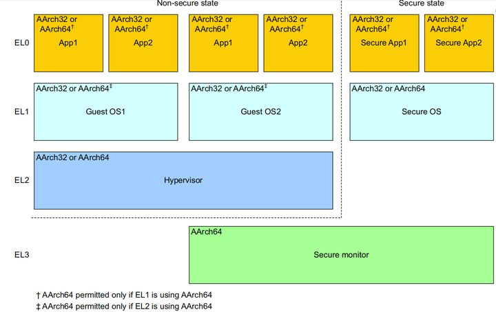

# openEuler与OP-TEE的适配

Kunpeng920芯片支持ARM Trust Zone技术，理论上可以支持基于ARM的可信执行环境（Trusted Execution Environment）解决方法。Trust Zone技术将ARM CPU 的执行环境分为正常世界状态（Normal World State）和安全世界状态（Secure World State）两种状态，其中在正常世界状态执行的程序不能访问安全世界状态中的内存、缓存和其他外围安全硬件设备，从而提供了硬件级别的安全隔离。

在ARMv8架构中，CPU的执行等级可以分配EL0~EL3，其中EL0执行等级用于运行用户应用程序；EL1执行等级用于运行操作系统内核；EL2执行等级用于支持非安全操作下的虚拟化；EL3则用于安全世界状态和正常世界状态之间的转换。执行等级与安全状态之间的关系如下图所示：

在上图中我们可以看到，Guest OS(如Linux，Android等)运行在正常世界状态中，它们的运行资源较为丰富，也被称为丰富执行环境（Rich Execution Environment）。而在安全世界状态中，则运行着安全操作系统（也叫可信执行环境操作系统，TEE OS ）和安全应用（也叫可信应用 Trusted Application, TA）。即使REE不可信，它也无法访问安全世界状态中的系统资源，如安全设备、安全内存数据和安全缓存数据等。从而用户可以将敏感数据保存在安全世界状态中，然后由TA来完成相关的数据处理。运行在安全世界状态的代码可以访问REE侧的地址空间。REE侧的程序可以通过运行在正常世界状态的客户端应用（Client Application，CA）来获取安全世界状态中特定的数据和调用特定的功能。为完成安全世界状态和正常世界状态之间的切换，系统执行smc指令进入EL3的Secure Monitor模式，并在该模式下实现状态切换。

从硬件的角度来看，为实现Trust Zone， ARMv8架构（1）为总线增加了安全位；（2）对MMU中的页表增加了安全位;(3)为缓存增加了安全位；（4）为外围组件进行扩展，增加安全操作全新控制和安全造作信号。当主设备发起读写操作时，从设备能检查总线上的安全位，从而防止从正常世界状态访问安全设备。同时，TrustZone也通过地址空间控制组将将从设备地址空间分为安全空间和非安全空间，安全空间的地址将会拒绝正常世界状态的访问，这种机制也用于控制对片外DRAM的访问。对于片上ROM或片上静态ARM，Trust Zone通过内存适配器组件将其划分为安全区域和非安全区域。对于外设，Trust Zone则通过保护控制器组件区分安全外设和非安全外设。

未完待续。。。。。。

---

### 参考文献

[1]《手机安全和可信应用开发指南：Trust Zone与OP-TEE技术详解》帅峰云，黄腾，宋洋著，2018
